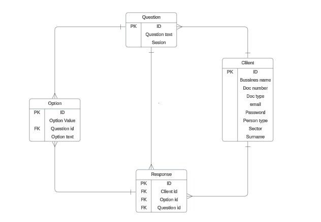
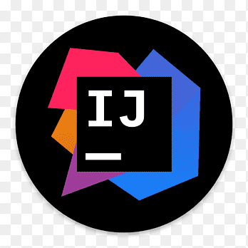
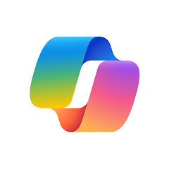
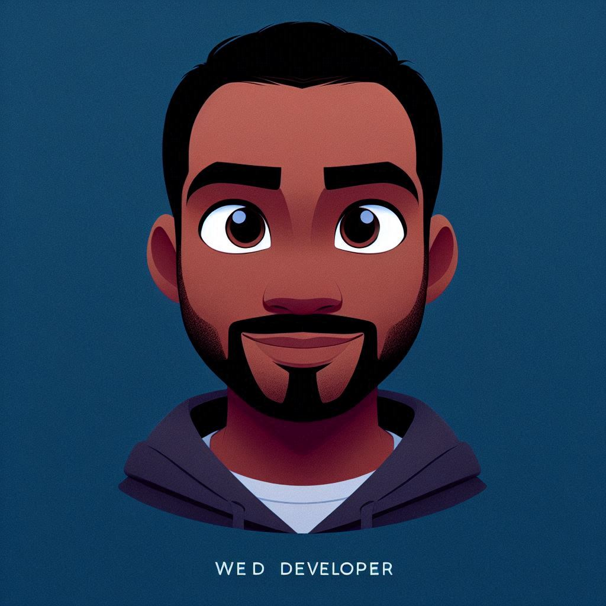

<h1 style="text-align: center;"><strong>Estramipyme - BackEnd</strong></h1>

#### Estramipyme es una plataforma diseñada para ayudar a emprendedores de pequeñas, medianas y grandes empresas a conocer el estado de su negocio y proporcionar estrategias para mejorarlo.

#### Este repositorio contiene el backend de la aplicación, desarrollado en Java utilizando Spring Boot y Maven. La API proporciona funcionalidades para gestionar usuarios, preguntas y respuestas de los cuestionarios. Los usuarios pueden registrarse, iniciar sesión y completar cuestionarios interactivos, cuyos resultados son visualizados a través de gráficos en el frontend.

  <a href="https://estramipime.web.app/"><strong>Visita Estramipyme aquí</strong></a>

## **Estructura y Características del Backend**

El backend de Estramipyme está desarrollado utilizando **Java** con el framework **Spring Boot** y gestionado con **Maven**. Este backend proporciona una `*API RESTful`\* que maneja la lógica de negocio, la gestión de datos y la autenticación de usuarios, permitiendo que el frontend se conecte de manera eficiente y segura para la visualización de resultados y la interacción con los usuarios.

- **Autenticación y Gestión de Usuarios:** El backend permite a los usuarios registrarse, iniciar sesión y gestionar sus credenciales de manera segura. Para ello, se implementaron servicios de autenticación que incluyen validación de usuario, cifrado de contraseñas y gestión de sesione

- **Gestión de Preguntas y Opciones:** Se proporciona un conjunto de endpoints para administrar las preguntas y sus opciones. Los administradores pueden crear, editar, eliminar y recuperar preguntas que alimentan los cuestionarios. Los usuarios responden a estas preguntas a través del frontend, cuyos resultados se procesan y almacenan para su análisis.

- **API de Resultados y Progreso del Test:** Los resultados de los cuestionarios se generan dinámicamente en función de las respuestas del usuario. A medida que el usuario completa el test, el backend calcula y almacena el progreso de la encuesta, así como las respuestas a cada pregunta, alimentando los gráficos interactivos como el Radar Estratégico Organizacional y el Círculo Dorado de Sinek.

- **Base de Datos y Almacenamiento de Datos:** La base de datos está diseñada para almacenar información relacionada con los clientes, las preguntas del cuestionario, las opciones y las respuestas de los usuarios. Utiliza PostgreSQL como sistema de gestión de base de datos, que es una solución robusta y escalable. Además, se implementaron mecanismos de validación para asegurar que no existan respuestas incompletas o erróneas.
- **Diagrama Entidad-Relación (ER):**
  A continuación se presenta el diagrama entidad-relación (ER) que ilustra cómo las entidades principales (Client, Question, Option, Response) están relacionadas entre sí:

  

\*Este diagrama muestra las relaciones entre las tablas de la base de datos y cómo se gestionan los datos de los clientes, preguntas, opciones y respuestas dentro del sistema.

- **Endpoints de la API:**

| **Funcionalidad**        | **Método** | **Endpoint**        | **Descripción**                                                               |
| ------------------------ | ---------- | ------------------- | ----------------------------------------------------------------------------- |
| Autenticación y Sesiones | POST       | `/api/auth/login`   | Inicia sesión con las credenciales del usuario y obtiene un token JWT.        |
| Autenticación y Sesiones | POST       | `/api/auth/refresh` | Solicita un nuevo token JWT usando un token de actualización (refresh token). |
| Autenticación y Sesiones | POST       | `/api/auth/logout`  | Cierra la sesión del usuario.                                                 |

- **Seguridad y Validación:** El backend incluye mecanismos de seguridad como la autenticación basada en JWT (JSON Web Token) {y la validación de datos de entrada para prevenir ataques como inyecciones SQL, XSS, entre otros}. Además, se valida que todas las respuestas sean completas antes de generar los resultados.

- **Integración con el Frontend:** El backend está completamente integrado con el frontend, proporcionando los datos necesarios para los gráficos y la interacción del usuario. A través de las APIs, el frontend puede consultar las preguntas, enviar las respuestas y obtener los resultados, que luego se presentan visualmente al usuario.

- **Escalabilidad y Mantenimiento:** El backend está diseñado para ser fácilmente escalable y mantenible. Utiliza principios de diseño como la separación de responsabilidades, patrones de diseño y una estructura de código modular, lo que facilita la extensión y el mantenimiento de nuevas funcionalidades en el futuro.

- **CRUD Básico para Modelos:** En el backend, se han implementado operaciones CRUD (Crear, Leer, Actualizar y Eliminar) para los siguientes modelos: Client, Question, Option y Response. Un CRUD es un conjunto de operaciones fundamentales que permiten crear, leer, actualizar y eliminar datos en una base de datos. Como se muestra a continuación:

| **Entidad**  | **Crear**                                       | **Leer**                                              | **Actualizar**                                    | **Eliminar**                                     |
| ------------ | ----------------------------------------------- | ----------------------------------------------------- | ------------------------------------------------- | ------------------------------------------------ |
| **Client**   | Registrar un nuevo cliente en la base de datos. | Recuperar los datos de un cliente específico.         | Modificar la información de un cliente existente. | Eliminar un cliente de la base de datos.         |
| **Question** | Añadir nuevas preguntas al cuestionario.        | Recuperar preguntas existentes.                       | Modificar una pregunta existente.                 | Eliminar una pregunta no relevante.              |
| **Option**   | Añadir opciones a una pregunta específica.      | Recuperar las opciones disponibles para una pregunta. | Modificar las opciones de una pregunta.           | Eliminar una opción si ya no es necesaria.       |
| **Response** | Guardar las respuestas de los usuarios.         | Recuperar las respuestas almacenadas.                 | Actualizar respuestas si es necesario.            | Eliminar respuestas registradas si es necesario. |

## **Accede a Estramipyme y sus Manuales**

  <a href="https://estramipime.web.app/"><strong>Visita Estramipyme aquí</strong></a>

  <a href="https://view.genially.com/66bd54d7c5ecc5bc824909c4/presentation-manual-de-usuario-estramipyme"><strong>Manual de Usuario Estramipyme (Español)</strong></a>

  <a href="https://view.genially.com/67410e1ff6a09a7b8a164fe2/presentation-manual-de-usuario-estramipyme"><strong>Estramipyme User Manual (English)</strong></a>

## **Tecnologías Utilizadas en el Backend**

En este proyecto se utilizaron las siguientes tecnologías, lenguajes y herramientas:

- **Java:** Lenguaje principal para el desarrollo.
- **Spring Boot:** Framework para crear aplicaciones Java de manera rápida y sencilla.
- **Maven:** Herramienta de gestión y construcción de proyectos.
- **JWT (JSON Web Token):** Para la autenticación y autorización segura.
- **PostgreSQL:** Base de datos relacional utilizada para almacenar usuarios, respuestas y resultados.
- **Spring Security:** Para gestionar la autenticación y autorización.
- **Lombok**: Biblioteca Java que elimina la necesidad de escribir código repetitivo como getters, setters, constructores, y más.

## **Otras Herramientas Utilizadas**

-  **IntelliJ IDEA:** IDE utilizado para el desarrollo en Java, proporcionando herramientas para codificación y depuración eficientes.

-  **Github:** Utilizado para la gestión de versiones y colaboración en el proyecto.

- **Jira:** Herramienta para la gestión de proyectos, seguimiento de tareas y sprints.

-  **Google Meet:** Utilizado para la comunicación (dailys y reuniones) y coordinación del equipo durante el desarrollo en un entorno remoto.

-  **Angular:** Framework utilizado para los toques finales en la integración entre el frontend y el backend, permitiendo la comunicación eficiente con la API RESTful y la implementación de funcionalidades adicionales.

-  **Visual Studio Code**: Editor de código utilizado para el desarrollo del frontend, proporcionando herramientas para trabajar con Angular y otros lenguajes.

-  **Copilot:** Utilizado para la creación de imágenes de los integrantes del equipo utilizando DALL·E 3.

## **Conoce al Equipo - Spring Boot Masters**

<h2 style="text-align: center;">Leonard</h2>

  

**Cargo:** Desarrollador Web - Team Lead   **Funciones:** Liderazgo, Investigación, Programación, Funcionalidad, Seguridad.   **Correo Electrónico:** villegas.leonard@gmail.com

<h2 style="text-align: center;">Angie</h2>

  

**Cargo:** Desarolladora Web   **Funciones:** Investigación, Programación, Funcionalidad, Diseño, Autenticación.   **Correo Electrónico:** angie.a.zapata@gmail.com

<h2 style="text-align: center;">Alejandra</h2>

  

**Cargo:** Desarrolladora Web   **Funciones:** Investigación, Programación, Funcionalidad, Autenticación.   **Correo Electrónico:** alejandrainfant@gmail.com

<h2 style="text-align: center;">Yuliana</h2>

  

**Cargo:** Desarolladora Web   **Funciones:** Investigación, Programación, Diseño.   **Correo Electrónico:** yuliandre16.07@hotmail.com

<h2 style="text-align: center;">Edwin</h2>

  

**Cargo:** Desarollador Web   **Funciones:** Investigación, Programación, Base de datos.   **Correo Electrónico:** edwincuteno12@gmail.com

<h2 style="text-align: center;">Melissa</h2>

  

**Cargo:** Desarolladora Web   **Funciones:** Investigación, Programación, Base de datos.   **Correo Electrónico:** melissagiseelle@gmail.com

## **Referencias**

- **Libro Estramipyme de Luz María Rivas-Montoya** - Guía completa para la aplicación de la metodología Estramipyme.
- [Círculo Dorado de Simon Sinek](https://www.startwithwhy.com) - Referencia utilizada para la implementación del gráfico del Círculo Dorado en el proyecto.
- [Angular Documentation](https://angular.io/docs) - Recurso principal para la migración y desarrollo del proyecto en Angular.
- [ECharts Documentation](https://echarts.apache.org/en/index.html) - Referencia utilizada para la creación y personalización de gráficos en la página.
- [Chart.js Documentation](https://www.chartjs.org/docs/latest/) - Fuente de consulta para la integración de gráficos interactivos en el proyecto.
- **Manual de Marca Eafit** - Consultado para el uso de fuentes y colores en el diseño de la página.
